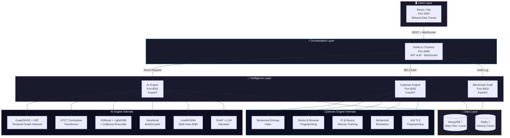
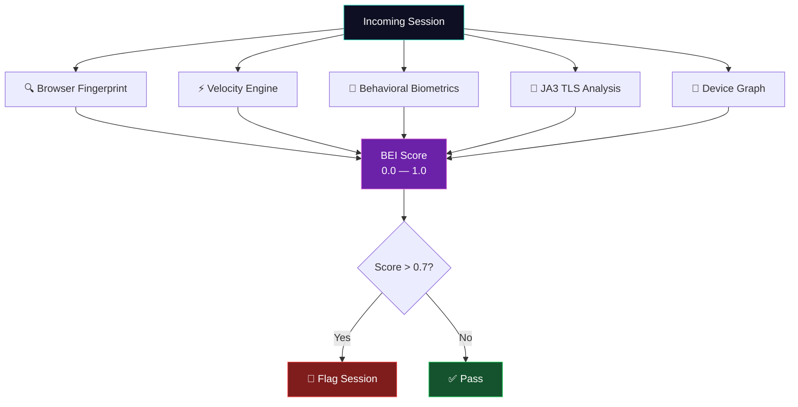

<div align="center">

```
 ███╗   ██╗██╗   ██╗██╗  ██╗ █████╗ ██████╗  █████╗
 ████╗  ██║╚██╗ ██╔╝╚██╗██╔╝██╔══██╗██╔══██╗██╔══██╗
 ██╔██╗ ██║ ╚████╔╝  ╚███╔╝ ███████║██████╔╝███████║
 ██║╚██╗██║  ╚██╔╝   ██╔██╗ ██╔══██║██╔══██╗██╔══██║
 ██║ ╚████║   ██║   ██╔╝ ██╗██║  ██║██║  ██║██║  ██║
 ╚═╝  ╚═══╝   ╚═╝   ╚═╝  ╚═╝╚═╝  ╚═╝╚═╝  ╚═╝╚═╝  ╚═╝
```

### 🔮 AI-Powered Mule Account Detection Platform

> *"Where others see transactions, Nyxara reads the shadow network behind them."*

**National Level Hackathon · Team Nyxara · June 2026**

[](https://python.org)
[](https://react.dev)
[](https://fastapi.tiangolo.com)
[](https://nodejs.org)
[](https://mongodb.com)
[](https://redis.io)

<br/>

[](#-dataset--feature-engineering)
[](#-6-layer-detection-stack)
[-2DD4BF?style=flat-square&labelColor=0D3B2F)](#-zero-cost-architecture)
[](#-training-the-models)
[](#)

<br/>

**6-Layer AI Detection** · **Behavioral Entropy Index** · **Blockchain Audit Trail** · **FIU-IND Compliance**

---

</div>

<br/>

## 📖 Table of Contents

<details>
<summary><b>Click to expand navigation</b></summary>

- [Why Nyxara?](#-why-nyxara)
- [Architecture Overview](#-architecture-overview)
- [6-Layer Detection Stack](#-6-layer-detection-stack)
- [Cybersecurity Layer — BEI](#-cybersecurity-layer--behavioral-entropy-index)
- [Blockchain Audit Trail](#-blockchain-audit-trail)
- [Dataset & Feature Engineering](#-dataset--feature-engineering)
- [Key Features](#-key-features)
- [Zero-Cost Architecture](#-zero-cost-architecture)
- [Quick Start](#-quick-start)
- [Services & Ports](#-services--ports)
- [API Reference](#-api-reference)
- [Training the Models](#-training-the-models)
- [Frontend Dashboard](#-frontend-dashboard)
- [Project Structure](#-project-structure)
- [Research Citations](#-research-citations)
- [Team Nyxara](#-team-nyxara)

</details>

<br/>

---

<br/>

## 🌑 Why Nyxara?

<table>
<tr>
<td width="60%">

**The Shadow Economy Problem**

Every year, **₹1.25 lakh crore** flows through mule accounts in India — bank accounts opened or hijacked to launder proceeds of cyber fraud. These accounts are the invisible arteries of digital crime: phishing scams, investment fraud, loan-app rackets, and ransomware payments all depend on them.

On **May 12, 2026**, the RBI's Innovation Hub (RBIH) signed a landmark MoU with the Indian Cyber Crime Coordination Centre (I4C) to build a national **Suspect Registry** and deploy **MuleHunter.AI** across India's banking infrastructure.

**Nyxara is built for this moment.**

While legacy systems rely on static rules (*"flag transfers > ₹10L"*), Nyxara deploys a **6-layer AI detection stack** that reads the *temporal shadow network* behind transactions — detecting dormant-to-active mule lifecycle patterns, zero-day laundering tactics, and coordinated ring structures that no rule could catch.

</td>
<td width="40%">

```
   ╭─────────────────────────╮
   │   THE MULE LIFECYCLE    │
   │                         │
   │  ① Account Dormancy     │
   │       ↓                 │
   │  ② Sudden Activation    │
   │       ↓                 │
   │  ③ Rapid Fund Inflow    │
   │       ↓                 │
   │  ④ Pass-Through Splits  │
   │       ↓                 │
   │  ⑤ Immediate Outflow    │
   │       ↓                 │
   │  ⑥ Account Abandonment  │
   │                         │
   │  Nyxara catches every   │
   │  stage of this cycle.   │
   ╰─────────────────────────╯
```

</td>
</tr>
</table>

> [!IMPORTANT]
> **Regulatory Alignment** — Nyxara is designed to comply with FIU-IND's Suspicious Transaction Report (STR) format and aligns with the I4C-RBIH MoU (May 12, 2026) on automated mule detection across India's banking ecosystem.

<br/>

---

<br/>

## 🏗 Architecture Overview



<br/>

---

<br/>

## 🧠 6-Layer Detection Stack

> *Each layer sees what the others miss. Together, they see everything.*

```mermaid
graph LR
    INPUT["Account<br/>Data"] --> L1
    L1["Layer 1<br/>TGN"] --> L2["Layer 2<br/>GTCT"]
    L2 --> L3["Layer 3<br/>Ensemble"]
    L3 --> L4["Layer 4<br/>VAE"]
    L4 --> L5["Layer 5<br/>LineMVGNN"]
    L5 --> L6["Layer 6<br/>SHAP + LLM"]
    L6 --> OUTPUT["Risk Score<br/>+ STR Report"]

    style L1 fill:#6B21A8,stroke:#DA70D6,color:#fff
    style L2 fill:#5B21B6,stroke:#DA70D6,color:#fff
    style L3 fill:#4C1D95,stroke:#DA70D6,color:#fff
    style L4 fill:#3B0764,stroke:#DA70D6,color:#fff
    style L5 fill:#2E1065,stroke:#DA70D6,color:#fff
    style L6 fill:#1E0A3C,stroke:#DA70D6,color:#fff
    style INPUT fill:#0f0f23,stroke:#06B6D4,color:#fff
    style OUTPUT fill:#0f0f23,stroke:#2DD4BF,color:#fff
```



<br/>

| Layer | Model | Architecture | What It Catches | Key Insight |
|:-----:|:------|:-------------|:----------------|:------------|
| **1** | **Temporal Graph Network (TGN)** | GraphSAGE + GAT message passing | Dormant → activated mule lifecycle | Accounts don't exist in isolation; their *temporal neighborhood* reveals intent |
| **2** | **GTCT Contrastive Transformer** | Graph-Temporal Contrastive Learning | Zero-label fraud patterns (+0.062 AUC uplift) | Learns fraud embeddings *without labeled fraud data* via contrastive objectives |
| **3** | **Gradient Boosted Ensemble** | XGBoost + LightGBM + CatBoost + Meta-Learner | Tabular financial anomalies | Three diverse learners with stacking meta-learner eliminate individual model blind spots |
| **4** | **Variational AutoEncoder (VAE)** | Encoder-Decoder with KL divergence | Zero-day mule tactics via reconstruction error | High reconstruction error = the model has *never seen this pattern* = novel threat |
| **5** | **LineMVGNN** | Multi-View Graph Neural Network | Simultaneous account + transaction graph | Analyzes the *line graph* (edge-centric view) alongside the node graph for dual perspective |
| **6** | **SHAP + LLM Narration** | TreeSHAP + Anthropic Claude | Explainability → FIU-IND STR compliance | Every flag comes with *human-readable reasoning* — not a black-box score |

> [!TIP]
> **Weighted Fusion** — The final risk score is computed via configurable weighted fusion:
> `GNN (0.35) + Ensemble (0.25) + VAE (0.20) + BEI (0.12) + Graph (0.08) = 1.0`
> Weights are tunable via environment variables without code changes.

<br/>

### Risk Decision Thresholds

| Risk Score | Decision | Action |
|:----------:|:---------|:-------|
| `< 0.40` | ✅ **Approve** | Account cleared — no anomalies detected |
| `0.40 — 0.70` | 🔍 **Review** | Manual review queue — analyst intervention |
| `0.70 — 0.85` | 🟡 **Escalate** | Priority review with SHAP explanation |
| `> 0.85` | 🔴 **Flag** | Automatic STR generation + blockchain audit log |

<br/>

---

<br/>

## 🛡 Cybersecurity Layer — Behavioral Entropy Index

The **BEI (Behavioral Entropy Index)** is Nyxara's cybersecurity heartbeat — a real-time behavioral scoring engine that detects when *the person behind the account isn't who they claim to be*.

<br/>



<br/>

| Module | Signals Analyzed | Detection Capability |
|:-------|:-----------------|:---------------------|
| **Browser Fingerprint** | Canvas hash, WebGL renderer, screen resolution, timezone offset, AudioContext hash | Detects shared/spoofed browser environments across mule accounts |
| **Headless Detection** | `navigator.webdriver`, phantom properties, Chrome DevTools protocol | Catches automated account creation bots |
| **JA3 TLS Fingerprint** | TLS client hello hash analysis | Matches against known malware signatures: **Trickbot**, **Dridex**, **Cobalt Strike** |
| **Device Velocity** | Account-per-device ratio over 24h window | `>5 accounts/device in 24h` → flagged as mule farm |
| **IP Velocity** | Account-per-IP ratio over 1h window (Redis-backed) | `>3 accounts/IP in 1h` → coordinated creation detected |
| **Behavioral Biometrics** | Typing rhythm CV, mouse movement entropy, session interaction velocity | Distinguishes human operators from bot/script behavior |

> [!WARNING]
> **Known Threat Signatures** — The JA3 module maintains a hash database of known C2 (Command & Control) TLS fingerprints. Matches against Trickbot, Dridex, or Cobalt Strike signatures trigger immediate escalation regardless of other scores.

<br/>

---

<br/>

## ⛓ Blockchain Audit Trail

Every risk decision Nyxara makes is **cryptographically sealed** into an immutable audit chain — ensuring that no score, no flag, and no clearance can be retroactively altered.

<br/>

| Component | Implementation | Purpose |
|:----------|:---------------|:--------|
| **Hash Algorithm** | SHA-256 | Cryptographic integrity of each decision record |
| **Merkle Tree** | Binary tree of decision hashes | Efficient batch verification — prove any single decision without replaying the entire chain |
| **Batching** | Every 50 decisions | Decisions are batched into Merkle roots for storage efficiency |
| **Tamper Detection** | Chain validation endpoint | Any modification to historical records breaks the hash chain → tamper alert |
| **Storage** | MongoDB (persistent) | Merkle roots + individual decision records stored with timestamps |

> [!NOTE]
> **Why Blockchain-Style Audit?** — FIU-IND and RBI auditors need verifiable proof that risk scores weren't manipulated post-facto. Nyxara's hash chain provides cryptographic non-repudiation for every decision — a critical requirement for regulatory trust.

<br/>

---

<br/>

## 📊 Dataset & Feature Engineering

### Source Dataset

| Property | Value |
|:---------|:------|
| File | `compressed_DataSet.xlsx` |
| Rows | **9,082** accounts |
| Raw Features | **3,924** columns |
| Final Features | **50** (after 5-stage selection) |
| Target | Mule account label (binary) |

<br/>

### 5-Stage Feature Selection Pipeline

```
3,924 features ──→ Stage 1 ──→ Stage 2 ──→ Stage 3 ──→ Stage 4 ──→ Stage 5 ──→ 50 features
                  Variance    Missing     Mutual       Correlation   SHAP
                  Threshold   Rate <70%   Information  Filter <0.95  Importance
```

| Stage | Method | Action | Rationale |
|:-----:|:-------|:-------|:----------|
| 1 | **Variance Threshold** | Drop near-zero-variance columns | Features that barely change carry no signal |
| 2 | **Missing Rate Filter** | Drop columns with >70% missing values | Imputation of mostly-empty columns adds noise |
| 3 | **Mutual Information** | Rank by MI score, keep top candidates | Measures non-linear dependency with the target |
| 4 | **Correlation Filter** | Drop one of each pair with Pearson r > 0.95 | Removes redundant collinear features |
| 5 | **SHAP Importance** | Keep top 50 by mean |SHAP value| | Final selection driven by actual model explanatory power |

<br/>

### 12 Composite Features

Nyxara engineers **12 domain-specific composite features** that encode financial crime knowledge directly into the feature space:

| Feature | Formula Logic | What It Captures |
|:--------|:-------------|:-----------------|
| `occupation_velocity_anomaly` | Throughput vs. occupation-specific median | Student with ₹50L throughput = 10× more anomalous than self-employed |
| `pass_through_score` | Inflow-outflow timing correlation | Money in → immediately out = classic pass-through |
| `financial_impossibility_score` | Income vs. transaction volume ratio | Transactions that are mathematically impossible given stated income |
| `temporal_burst_index` | Transaction clustering in time | Sudden burst after dormancy = activation signal |
| `counterparty_concentration` | HHI of transaction counterparties | All money going to/from one entity = suspicious |
| `round_amount_ratio` | % of transactions at round numbers | Round amounts (₹10K, ₹50K) dominate laundering |
| `nocturnal_activity_ratio` | % of transactions between 12AM–5AM | Unusual activity hours correlate with mule ops |
| `velocity_acceleration` | Rate of change of transaction velocity | Not just fast — *accelerating* fast |
| `dormancy_spike_ratio` | Activity ratio: recent vs. historical | 0 activity for 6 months → sudden spike |
| `geographic_dispersion` | Entropy of transaction locations | Single person transacting from 15 states = red flag |
| `device_switching_rate` | Unique devices per session window | Rapid device changes indicate shared mule access |
| `cascade_depth_score` | Max depth in transaction chains | Deep chains = layering stage of money laundering |

<br/>

---

<br/>

## ✨ Key Features

<table>
<tr>
<td width="50%">

### 🕸 Real-Time Ring Detection
D3.js-powered graph visualization with live animation of detected mule ring topologies:
- **STAR** — Central hub distributing to spokes
- **CHAIN** — Linear pass-through sequence
- **CYCLE** — Circular fund rotation
- **CLUSTER** — Dense interconnected group
- **BIPARTITE** — Two-group split pattern

Powered by **Louvain community detection** + **PageRank hub scoring**.

</td>
<td width="50%">

### 📝 LLM-Narrated Compliance
Every flagged account receives an auto-generated **Suspicious Transaction Report (STR)** narrative:

- **Primary**: Anthropic Claude generates FIU-IND compliant natural language
- **Fallback**: Rule-based template narrator (zero API dependency)
- SHAP feature attributions woven into narrative
- Ready for direct FIU-IND portal submission

</td>
</tr>
<tr>
<td width="50%">

### 🔒 Blockchain-Sealed Decisions
Every risk score and decision is:
- SHA-256 hashed individually
- Batched into Merkle trees (every 50 decisions)
- Chain-linked to previous batch
- Tamper-detectable in real time

*No score can be altered after the fact.*

</td>
<td width="50%">

### 📡 Live WebSocket Updates
The dashboard receives **real-time push notifications** via WebSocket:
- New risk scores as they compute
- Ring detection alerts
- BEI anomaly triggers
- Blockchain verification status

*No polling. No delays. Instant situational awareness.*

</td>
</tr>
</table>

<br/>

---

<br/>

## 💸 Zero-Cost Architecture

> *Nyxara proves that world-class AI security doesn't require a budget — just better engineering.*

Every component of Nyxara runs on **free, open-source tools**. Total infrastructure cost: **₹0**.

| Component | Free Tool Used | Paid Alternative It Replaces |
|:----------|:---------------|:-----------------------------|
| **Database** | MongoDB Atlas Free Tier / Local Docker | AWS DocumentDB (~$200/mo) |
| **Cache** | Redis Docker / Upstash Free Tier | ElastiCache (~$50/mo) |
| **AI Models** | scikit-learn, XGBoost, PyTorch (CPU) | SageMaker (~$300/mo) |
| **LLM Narration** | Anthropic free credits / Rule-based fallback | GPT-4 API (~$100/mo) |
| **Frontend** | React + Vite + Tailwind CSS | Licensed UI frameworks |
| **Backend** | Node.js + Express | Enterprise API gateways |
| **Microservices** | FastAPI (Python) | AWS Lambda (~$50/mo) |
| **Containerization** | Docker Compose | Kubernetes clusters |
| **Version Control** | Git + GitHub | Enterprise SCM |
| **GPU** | **Not required** (CPU training: 30-60 min) | GPU instances (~$1/hr) |

> [!TIP]
> **Google Colab Turbo** — While GPU isn't required, training on a free Colab T4 GPU reduces time from ~60 min to ~5 min. The models are identical regardless of training hardware.

<br/>

---

<br/>

## 🚀 Quick Start

### Prerequisites

| Requirement | Version | Check Command |
|:------------|:--------|:--------------|
| **Node.js** | 18+ | `node --version` |
| **Python** | 3.10+ | `python --version` |
| **Docker** | 20+ | `docker --version` |
| **pip** | Latest | `pip --version` |

<br/>

### Launch in 5 Steps

**① Clone & Enter**
```bash
git clone <repo-url> && cd nyxara
```

**② Place Dataset**
```bash
cp /path/to/compressed_DataSet.xlsx data/
```

**③ Configure Environment**
```bash
cp .env.example .env
# Optional: Add ANTHROPIC_API_KEY for LLM-narrated alerts
# Without it, the rule-based fallback narrator works perfectly
```

**④ Start Infrastructure**
```bash
docker-compose up mongo redis -d
```

**⑤ Start All Services**
```bash
# Terminal 1 — AI Engine
cd ai-engine && pip install -r requirements.txt && uvicorn main:app --port 8001

# Terminal 2 — Cybersec Engine
cd cybersec-engine && pip install -r requirements.txt && uvicorn main:app --port 8002

# Terminal 3 — Blockchain Audit
cd blockchain-audit && pip install -r requirements.txt && uvicorn main:app --port 8003

# Terminal 4 — Backend
cd backend && npm install && npm run dev

# Terminal 5 — Frontend
cd frontend && npm install && npm run dev
```

<br/>

> [!NOTE]
> **Or use Docker Compose for everything:**
> ```bash
> docker-compose up --build
> ```
> This starts all 5 services + MongoDB + Redis in one command.

<br/>

### Access the Platform

| | URL | Credentials |
|:-:|:-----|:------------|
| 🌐 | **http://localhost:3000** | `admin@nyxara.ai` / `nyxara2026` |
| 📡 | **http://localhost:8080** | Backend API (JWT required) |
| 🧠 | **http://localhost:8001/docs** | AI Engine — Swagger UI |
| 🛡 | **http://localhost:8002/docs** | Cybersec Engine — Swagger UI |
| ⛓ | **http://localhost:8003/docs** | Blockchain Audit — Swagger UI |

<br/>

---

<br/>

## 🔌 Services & Ports

| Service | Port | Stack | Responsibilities |
|:--------|:----:|:------|:-----------------|
| **Frontend** | `3000` | React 18 · Vite · Tailwind CSS | Dashboard, Analyzer, Graph View, Alerts, Compliance, Metrics |
| **Backend** | `8080` | Node.js · Express · Socket.IO | JWT authentication, WebSocket push, service orchestration, MongoDB CRUD |
| **AI Engine** | `8001` | Python · FastAPI | GNN, GTCT, Ensemble, VAE, LineMVGNN, SHAP explainer, LLM narrator |
| **Cybersec Engine** | `8002` | Python · FastAPI | BEI scoring, device fingerprinting, velocity tracking, biometrics, JA3 |
| **Blockchain Audit** | `8003` | Python · FastAPI | Merkle tree construction, SHA-256 hash chain, tamper verification |
| **MongoDB** | `27017` | MongoDB 7 | Account data, risk scores, alerts, audit chain, compliance reports |
| **Redis** | `6379` | Redis 7 Alpine | BEI velocity counters, session cache, rate limiting |

<br/>

---

<br/>

## 📡 API Reference

### AI Engine — `localhost:8001`

| Method | Endpoint | Description |
|:------:|:---------|:------------|
| `POST` | `/api/score` | Score a single account — returns risk score + component breakdown |
| `POST` | `/api/batch` | Batch score multiple accounts |
| `POST` | `/api/explain` | SHAP explanation for a scored account |
| `GET` | `/api/rings` | Detect mule ring topologies in the transaction graph |
| `GET` | `/api/clusters` | Louvain community detection results |
| `GET` | `/api/metrics` | Model performance metrics (AUC, precision, recall) |
| `GET` | `/api/health` | Health check + model load status |

### Backend — `localhost:8080`

| Method | Endpoint | Description |
|:------:|:---------|:------------|
| `POST` | `/api/auth/login` | JWT authentication |
| `POST` | `/api/auth/register` | User registration (admin only) |
| `GET` | `/api/accounts` | Paginated account list with risk scores |
| `GET` | `/api/accounts/:id` | Single account detail + full analysis |
| `GET` | `/api/alerts` | Active alert queue |
| `PATCH` | `/api/alerts/:id` | Update alert status (review/dismiss/escalate) |
| `GET` | `/api/compliance/reports` | FIU-IND STR report listing |
| `GET` | `/api/graph/data` | Graph visualization data for D3.js |
| `GET` | `/api/admin/stats` | Platform-wide statistics |

### Cybersec Engine — `localhost:8002`

| Method | Endpoint | Description |
|:------:|:---------|:------------|
| `POST` | `/api/bei/score` | Compute BEI score from session telemetry |
| `POST` | `/api/bei/fingerprint` | Browser/device fingerprint analysis |
| `POST` | `/api/bei/velocity` | Check device/IP velocity thresholds |

### Blockchain Audit — `localhost:8003`

| Method | Endpoint | Description |
|:------:|:---------|:------------|
| `POST` | `/api/audit/record` | Record a new decision to the audit chain |
| `GET` | `/api/audit/verify` | Verify chain integrity (tamper detection) |
| `GET` | `/api/audit/chain` | Retrieve the full audit chain |

<br/>

---

<br/>

## 🎓 Training the Models

```bash
cd ai-engine
python training/run_all.py --dataset ../data/compressed_DataSet.xlsx
```

| Environment | Time | Notes |
|:------------|:-----|:------|
| **CPU** (any modern laptop) | ~30–60 min | Default. No GPU drivers needed |
| **Google Colab T4** (free) | ~5 min | Upload dataset → run notebook → download artifacts |

Trained model artifacts are saved to `ai-engine/models/artifacts/` and auto-loaded on service startup.

> [!IMPORTANT]
> **First-run requirement** — Models must be trained before the AI Engine can serve predictions. The training script handles the full pipeline: data loading → preprocessing → 5-stage feature selection → model training → artifact serialization.

<br/>

---

<br/>

## 🖥 Frontend Dashboard

The frontend is a **dark-themed command center** built with React 18, Vite, and Tailwind CSS — designed for analyst workflows.

| Page | File | Purpose |
|:-----|:-----|:--------|
| **Dashboard** | `Dashboard.jsx` | Overview metrics, recent alerts, risk distribution charts |
| **Analyzer** | `Analyzer.jsx` | Deep-dive single account analysis with SHAP waterfall |
| **Graph View** | `GraphView.jsx` | D3.js interactive graph — ring detection, community clusters |
| **Alerts** | `Alerts.jsx` | Live alert queue with WebSocket push updates |
| **Compliance** | `Compliance.jsx` | FIU-IND STR report generation and export |
| **Metrics** | `Metrics.jsx` | Model performance tracking — AUC, precision, recall curves |
| **Login** | `Login.jsx` | JWT authentication gate |

<br/>

---

<br/>

## 📁 Project Structure

```
nyxara/
├── frontend/                    # React/Vite dashboard
│   ├── src/
│   │   ├── pages/               # Dashboard, Analyzer, GraphView, Alerts, Compliance, Metrics
│   │   ├── components/          # Reusable UI components
│   │   ├── context/             # React context (auth, theme)
│   │   ├── services/            # API client layer
│   │   └── styles/              # Tailwind config + custom CSS
│   ├── tailwind.config.js
│   └── vite.config.js
│
├── backend/                     # Node.js/Express orchestrator
│   ├── routes/                  # auth, accounts, alerts, compliance, graph, admin
│   ├── middleware/               # JWT verification, rate limiting
│   ├── models/                  # MongoDB schemas (Mongoose)
│   ├── services/                # Service orchestration logic
│   ├── config/                  # Database + service config
│   └── server.js                # Express entry point
│
├── ai-engine/                   # Python/FastAPI AI core
│   ├── api/routes/              # score, batch, explain, rings, clusters, metrics, health
│   ├── models/
│   │   ├── gnn/                 # GraphSAGE + GAT (Temporal Graph Network)
│   │   ├── ensemble/            # XGBoost + LightGBM + CatBoost + Meta-Learner
│   │   ├── anomaly/             # Variational AutoEncoder (VAE)
│   │   ├── community/           # Louvain + PageRank
│   │   └── artifacts/           # Serialized trained models
│   ├── inference/               # scorer, explainer, alert_narrator, cache
│   ├── preprocessing/           # loader, feature_selector, composite_features, encoder, scaler, balancer
│   ├── training/                # run_all.py — end-to-end training pipeline
│   └── main.py                  # FastAPI entry point
│
├── cybersec-engine/             # Python/FastAPI cybersecurity
│   ├── bei/                     # fingerprint, velocity, biometrics, device_graph
│   ├── ja3/                     # JA3 TLS fingerprint analysis
│   ├── api/                     # BEI scoring routes
│   └── main.py                  # FastAPI entry point
│
├── blockchain-audit/            # Python/FastAPI audit chain
│   ├── merkle.py                # Merkle tree implementation
│   ├── ledger.py                # Hash chain + batch logic
│   ├── api/                     # Audit recording + verification routes
│   └── main.py                  # FastAPI entry point
│
├── data/                        # Dataset directory
│   └── compressed_DataSet.xlsx  # 9,082 rows × 3,924 features
│
├── docker-compose.yml           # Full stack orchestration
├── .env.example                 # Environment template
└── readme.MD                    # ← You are here
```

<br/>

---

<br/>

## 📚 Research Citations

Nyxara's detection architecture is grounded in peer-reviewed research:

> **[1]** Kim Y, Choi J, Lee S, et al. *"Temporal Graph Networks for Graph Anomaly Detection in Financial Networks."*
> arXiv:2404.00060, April 2024.
> → Foundation for **Layer 1: TGN** (GraphSAGE + GAT temporal message passing)

> **[2]** *"Graph-Temporal Contrastive Transformer for Financial Fraud Detection."*
> MDPI Algorithms, 18(12):770, December 2025.
> → Foundation for **Layer 2: GTCT** (contrastive learning without labeled fraud data)

> **[3]** Poon CH, Yan Z, et al. *"LineMVGNN: A Multi-View Graph Neural Network for Anti-Money Laundering."*
> AI 2025; 6(4):69.
> → Foundation for **Layer 5: LineMVGNN** (dual account + transaction graph analysis)

> **[4]** Indian Cyber Crime Coordination Centre (I4C) & RBI Innovation Hub (RBIH).
> *"MoU on Suspect Registry and MuleHunter.AI."*
> Press Information Bureau, Government of India, May 12, 2026.
> → Regulatory context and compliance framework for Nyxara's design

<br/>

---

<br/>

## 👥 Team Nyxara

<div align="center">

**Built with 🔮 for India's FinSec Ecosystem**

*National Level Hackathon · June 2026*

<br/>

```
┌─────────────────────────────────────────────────────────────────┐
│                                                                 │
│   "The best way to predict the future of financial security     │
│    is to engineer it."                                          │
│                                                                 │
│                                         — Team Nyxara           │
│                                                                 │
└─────────────────────────────────────────────────────────────────┘
```

<br/>

[](https://github.com)
[](https://github.com)
[](https://github.com)

</div>