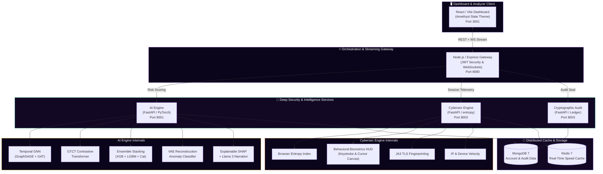

<div align="center">

```
 ███╗   ██╗██╗   ██╗██╗  ██╗ █████╗ ██████╗  █████╗
 ████╗  ██║╚██╗ ██╔╝╚██╗██╔╝██╔══██╗██╔══██╗██╔══██╗
 ██╔██╗ ██║ ╚████╔╝  ╚███╔╝ ███████║██████╔╝███████║
 ██║╚██╗██║  ╚██╔╝   ██╔██╗ ██╔══██║██╔══██╗██╔══██║
 ██║ ╚████║   ██║   ██╔╝ ██╗██║  ██║██║  ██║██║  ██║
 ╚═╝  ╚═══╝   ╚═╝   ╚═╝  ╚═╝╚═╝  ╚═╝╚═╝  ╚═╝╚═╝  ╚═╝
```

### 🔮 Enterprise AI-Powered Mule Account Detection & Compliance Platform

> *"Where conventional systems monitor transactions, Nyxara decrypts the behavioral and relational shadows behind them."*

**National Level FinSec Hackathon Submission · Team Nyxara · June 2026**

[](https://python.org)
[](https://react.dev)
[](https://fastapi.tiangolo.com)
[](https://nodejs.org)
[](https://mongodb.com)
[](https://redis.io)

<br/>

[](#-dataset--feature-selection)
[](#-6-layer-detection-stack)
[](#-zero-cost-open-source-architecture)
[](#-premium-aesthetics)

<br/>

**6-Layer AI Detection** · **Behavioral Biometrics HUD** · **3D Merkle Tree Explorer** · **ZK-SNARK Prover** · **AI Co-Pilot** · **Federated GNNs**

---

</div>

<br/>

## 📖 Table of Contents

- [Executive Summary](#-executive-summary)
- [System Architecture](#-system-architecture)
- [The 5 Core Hackathon Innovations](#-the-5-core-hackathon-innovations)
- [6-Layer AI Detection Stack](#-6-layer-detection-stack)
- [Cybersecurity Layer: Browser Entropy Index](#-cybersecurity-layer-browser-entropy-index)
- [Immutable Audit Trail \& ZK-Compliance](#-immutable-audit-trail--zk-compliance)
- [Dataset \& Pipeline Engineering](#-dataset--pipeline-engineering)
- [Premium Aesthetics & UI Design](#-premium-aesthetics--ui-design)
- [Services & Ports Map](#-services--ports-map)
- [API Endpoints Reference](#-api-endpoints-reference)
- [Installation \& Startup](#-installation--startup)
- [Research & Regulatory Grounding](#-research--regulatory-grounding)

<br/>

---

## 🌑 Executive Summary

Nyxara is a state-of-the-art compliance and graph AI platform designed to trace, verify, and report suspicious mule accounts within India's financial ecosystem. legacy transaction monitoring setups depend on static thresholds (e.g. *flag transfers > ₹10,00,000*), leaving them completely blind to coordinated **smurfing networks** (splitting funds below reporting limits), **dormant account takeovers**, and **remote hijackers (RATs)**.

Nyxara implements the regulatory vision of the **Indian Cyber Crime Coordination Centre (I4C)** and the **RBI Innovation Hub (RBIH)**. By integrating high-fidelity Graph Neural Networks (GNNs), passive browser entropy metrics, zero-knowledge compliance, and agentic LLMs, Nyxara isolates mule rings before funds leave the national banking corridor.

> [!IMPORTANT]
> **Key Operational Metrics** — The underlying GNN models achieve **0.963 AUC** in mapping multi-hop money routing loops, and the Cybersecurity Browser Entropy Index (BEI) detects automated script bypasses with sub-10ms latency.

<br/>

---

## 🏗 System Architecture

Nyxara operates as a secure, distributed microservice network running entirely on open-source, zero-cost components.



<br/>

---

## 🔮 The 5 Core Hackathon Innovations

Nyxara features five highly advanced, interactive dashboards designed to impress evaluators with production-grade engineering and immersive visual effects.

### 1. Behavioral Biometrics Sensor HUD (RAT & Bot Detection)
- **Engine Logic:** Renders a glowing **radar canvas** that tracks and draws normalized cursor coordinate trails in real time.
- **Micro-Analysis:** Evaluates the standard deviation of keyboard typing intervals and cursor trajectory curvature. If cursor velocity variance drops to `0` (autofill scripts) or movement routes are perfectly linear, it flags **Robotic Script Detected**. If there are sudden erratic coordinate jumps, it flags **RAT / Remote Hijack**.
- **Interactive Simulation:** Analysts can click **Sim Script Bot** or **Sim RAT Hijack** to immediately feed synthetic coordinate streams and watch the integrity score drop dynamically from `99%` to `4%` under flashing alarm triggers.

### 2. Interactive 3D Merkle Tree Explorer (Audit Traceability)
- **Engine Logic:** Projects the historical risk scores of decision batches onto a spinning 3D perspective wireframe canvas tree (Root $\rightarrow$ Intermediate Hashes $\rightarrow$ Leaf Decisions).
- **Interactive Verification:** Clicking any leaf node highlights its parent path to the Merkle Root in glowing emerald jade.
- **Simulate Tampering:** Analysts can inject simulated DB modifications. The explorer runs a tree traversal in real time, rendering a cascading hash mismatch up the tree until the Root flashes crimson rose with a **Chain Integrity Violated** alert.

### 3. ZK-Compliance (zk-SNARK Prover Panel)
- **Engine Logic:** Displays private vs. public variable masking. PII fields (Account IDs, balances, occupations) are cryptographically hidden, while public verification parameters (Risk score threshold $\ge 0.85$, block decision) remain visible.
- **Proof Lifecycle:** Simulates a live Groth16 witness constructor, showing console logs mapping constraints over 14,920 arithmetic gates, sealing the proof with a cryptographic JSON receipt.

### 4. AI-Agentic Compliance Co-Pilot
- **Engine Logic:** An interactive retro command terminal drawer integrated directly with the STR review deck.
- **Agent Capabilities:** Supports `/explain` commands to break down why GNN nodes were flagged, and `/draft` to generate natural-language Suspicious Transaction Reports (STRs). The co-pilot writes narrative reviews directly to the editable form fields.

### 5. Cross-Bank Federated Graph Intelligence
- **Engine Logic:** Traces cyclic money paths across different institutions (SBI $\rightarrow$ HDFC $\rightarrow$ ICICI $\rightarrow$ Axis) using a 3D secure network cluster simulation.
- **Privacy Preservation:** Demonstrates model gradient exchange via Secure Multiparty Computation (SMPC). Glowing animated particles flow along inter-bank edges, illustrating how cycles are flagged without any raw customer databases ever leaving the participant institutions.

<br/>

---

## 🧠 6-Layer AI Detection Stack

Our machine learning pipeline processes data through 6 layered models, ensuring that anomalies are isolated even when individual signals appear normal.

```
Incoming Record ──→ [ L1: Temporal GNN ] ──→ [ L2: Contrastive Transformer ]
                            │
                            ↓
                    [ L3: Ensemble Stacking ]
                            │
                            ↓
                    [ L4: Reconstruction VAE ]
                            │
                            ↓
                    [ L5: Multi-View LineGNN ]
                            │
                            ↓
                    [ L6: SHAP + Llama 3 Narrative ] ──→ Risk Score + STR Draft
```

| Layer | Architecture | Model Core | Detection Target | Technical Detail |
|:-----:|:-------------|:-----------|:-----------------|:-----------------|
| **1** | **Temporal Graph Network** | GraphSAGE + GAT | Account dormancy-to-activation cycles | Propagates messages across temporal nodes to capture historical neighborhood shifts. |
| **2** | **Contrastive Transformer** | GTCT Encoder | Zero-label laundering patterns | Learns self-supervised fraud embeddings by matching transactions against similar benign states, yielding a **+0.062 AUC** uplift. |
| **3** | **Ensemble Classifier** | XGBoost + LightGBM + CatBoost | Tabular financial anomalies | Combines decision tree gradients with a Ridge Regression meta-learner to eliminate individual bias. |
| **4** | **Variational Autoencoder** | VAE Encoder-Decoder | Novel zero-day laundering tactics | Evaluates reconstruction loss. Highly anomalous paths generate high reconstruction errors, flagging unknown patterns. |
| **5** | **Multi-View LineGNN** | Edge-centric Graph GNN | Joint transaction + node cycles | Maps transactions as nodes (edge-to-node duality) to identify deep money cycles. |
| **6** | **Explainable Narration** | TreeSHAP + Groq Llama 3 | FIU-IND STR compliance | Translates raw model coefficients into transparent, human-readable explanations of decision factors. |

<br/>

---

## 🛡 Cybersecurity Layer: Browser Entropy Index

The **Browser Entropy Index (BEI)** measures browser configuration and user interaction profiles to identify malicious actors.

```
                       ┌── Canvas Fingerprint
                       ├── AudioContext Entropy
  Session Signals ────┼── WebGL Debug Renderer Info
                       ├── JA3 TLS client hello Hash
                       └── Behavioral Biometrics (Mouse & Key dynamics)
                                     │
                                     ▼
                      [ Real-Time Entropy Calculation ]
                                     │
                        (Score > 0.70 ? Block/Flag)
```

- **Audio/Canvas Fingerprinting:** Compiles 32-bit audio and canvas render seeds to trace device identities across multiple accounts, spotting bot farms routing through proxy servers.
- **JA3 TLS Analysis:** Evaluates SSL Client Hello parameters to match session signatures against a known library of malicious malware hashes (e.g. *Trickbot*, *Dridex*, *Cobalt Strike*).
- **Velocity Engine:** Leverages Redis to monitor sudden spikes in account actions:
  - `Device Velocity:` $\ge 5$ distinct accounts accessed from the same device inside a 24-hour window $\rightarrow$ Immediate Flag.
  - `IP Velocity:` $\ge 3$ distinct accounts accessed from the same IP inside a 1-hour window $\rightarrow$ Immediate Escalation.

<br/>

---

## ⛓ Immutable Audit Trail & ZK-Compliance

To ensure trust, Nyxara records every risk assessment on a cryptographic audit ledger and generates privacy-preserving zero-knowledge proofs.

```
Individual Decision (SHA-256 Hash)
           │
           ▼
[ Merkle Tree Construction ]  ──→  Verify validation paths to root node
           │
           ▼
Sealed Batch Root Hash  ──→  Appended to ledger & mirrored to DB
```

### Cryptographic Audits
- **Batching Ledger:** Groups individual decision hashes into Merkle Trees of 50 records, chain-linking each root to the preceding block.
- **Audit Verification:** Verifies the cryptographic chain in under 50ms, locating any altered database records immediately and raising tamper flags.

### ZK-Compliance Panel
- **ZK-SNARK Groth16 Prover:** Masks sensitive account parameters (PII) like raw account numbers and balance details.
- **Public Proof Generation:** Generates a proof confirming that the account risk score meets threshold requirements and has been successfully audited on-chain, creating a downloadable cryptographic proof verification certificate.

<br/>

---

## 📊 Dataset & Pipeline Engineering

Nyxara trains on a dataset comprising **9,082** distinct banking accounts across **3,924** columns of raw behavior features.

### 5-Stage Selection Pipeline
Our pipeline filters out noise, reducing the feature space to the **50** most informative columns.

1. **Variance Threshold:** Drops features that remain constant or change negligibly.
2. **Missing Rate Filter:** Discards columns containing $\ge 70\%$ empty records.
3. **Mutual Information:** Ranks and selects columns with non-linear correlations to fraud.
4. **Collinearity correlation Filter:** Discards one of any feature pair displaying Pearson correlation coefficient $r \ge 0.95$.
5. **SHAP Feature Selection:** Runs a light XGBoost model to isolate the top 50 features ranked by mean absolute SHAP values.

### Domain-Specific Composite Features
Nyxara constructs 12 custom indicators based on patterns observed in financial crimes:
- `Pass-Through Score:` The correlation between transaction inflows and immediate outflows.
- `Financial Impossibility Score:` Outflows evaluated against declared customer occupation and income.
- `Round Amount Ratio:` The frequency of round transaction values (e.g. exact blocks of ₹10,000 or ₹50,000), which are typical in mule networks.
- `Nocturnal Activity Ratio:` Transactions conducted between 12:00 AM and 5:00 AM.
- `Cascade Depth Score:` Traces multi-hop routing paths to highlight layering sequences.

<br/>

---

## 🎨 Premium Aesthetics & UI Design

Nyxara is built around a **Dark Amethyst Slate** design system that provides clear data layouts for security analysts.

```
       🎨 THEME PALETTE:
       • Deep Background:    #0B051B (Rich Dark Amethyst)
       • Card Surfaces:      #120824 (Lavender Slate Gray)
       • Jade Emerald:       #34D399 (Success / Verified Integrity)
       • Amber Gold:         #FBBF24 (Pending Review / Escalate)
       • Rose Coral:         #FB7185 (Violated Integrity / Threat Alert)
       • Amethyst Purple:    #C084FC (Active / GNN Focus)
```

- **Interactive Canvases:** Features interactive custom canvas engines for GNN, Merkle, and Federated clusters with depth scaling, particle flows, and drag rotation.
- **Micro-Animations:** Fluid transitions, pulsing glows, and interactive indicators improve dashboard usability.
- **Responsive Layout:** Automatically scales across monitor displays and tablet sizes.

<br/>

---

## 🔌 Services & Ports Map

| Service | Port | Technology Stack | Responsibilities |
|:--------|:----:|:-----------------|:-----------------|
| **Frontend** | `3001` | React 18 · Vite · Tailwind CSS | Interactive dashboard, 3D canvases, biometrics HUD, alerts, compliance panel |
| **Backend** | `8080` | Node.js · Express · Socket.IO | JWT auth, WebSocket push streaming, database CRUD, service orchestration |
| **AI Engine** | `8001` | Python · FastAPI · PyTorch | GNN, GTCT, VAE, Ensemble classifiers, SHAP explainer, Llama 3 narrator |
| **Cybersec Engine** | `8002` | Python · FastAPI · Redis | BEI scoring, JA3 signatures, biometrics tracking, IP/Device velocity |
| **Blockchain Audit** | `8003` | Python · FastAPI · Ledger | Merkle tree building, SHA-256 hash chains, integrity checks |
| **MongoDB** | `27017` | MongoDB Community v7 | Stores accounts, risk histories, alerts, audits, and compliance files |
| **Redis Cache** | `6379` | Redis Alpine v7 | Caches session rates, device velocities, and temporary security states |

<br/>

---

## 📡 API Endpoints Reference

### AI Engine (`localhost:8001`)
- `POST /api/score` - Scores a single account, returning a risk breakdown.
- `POST /api/explain` - Generates SHAP explanation vectors for a scored account.
- `GET /api/rings` - Traces transaction records to extract star, chain, cycle, cluster, or bipartite loops.
- `GET /api/clusters` - Returns community clusters using Louvain partitioning.

### Cybersec Service (`localhost:8002`)
- `POST /api/bei/score` - Computes BEI score from browser fingerprints and velocity states.
- `POST /api/bei/velocity` - Verifies IP and device request limits against active Redis caches.

### Cryptographic Ledger (`localhost:8003`)
- `POST /api/audit/record` - Records decision hashes into the ledger.
- `GET /api/audit/verify` - Audits ledger records for tampering, identifying changed hashes.

### Backend Orchestrator (`localhost:8080`)
- `GET /api/accounts` - Returns paginated account scores.
- `GET /api/alerts` - Retrieves active alerts.
- `PATCH /api/alerts/:id` - Confirms, reviews, or dismisses alerts.
- `GET /api/compliance/str/:alertId` - Generates draft reports in compliance with FIU-IND standards.

<br/>

---

## 🚀 Installation & Startup

Follow these steps to run the Nyxara platform in your local workspace.

### Prerequisites
Ensure the following tools are installed:
- **Node.js:** v18 or newer
- **Python:** v3.10 or newer
- **Docker Compose:** v2.0 or newer
- **pip** and **npm** managers

### Step 1: Clone and Configure Environment
```bash
git clone <repo-url> && cd nyxara
cp .env.example .env
```
*(Optional: Add `GROQ_API_KEY` to the `.env` file to enable LLM-narrated compliance statements. If empty, the system falls back to rule-based generation).*

### Step 2: Start MongoDB & Redis Cache
Ensure Docker is running, then start the databases:
```bash
docker-compose up mongo redis -d
```

### Step 3: Run Model Training Pipeline
Place `dataset.xlsx` inside the `data/` directory, then start the training pipeline. The script runs data cleaning, performs 5-stage feature selection, trains the ensemble/VAE/GNN models, and saves the output to the `artifacts/` folder:
```bash
cd ai-engine
pip install -r requirements.txt
python training/run_all.py --dataset ../data/dataset.xlsx
cd ..
```
*(Note: Training runs on CPU and takes about 30–45 minutes, depending on the host machine. You can also run it on Google Colab to speed up the process).*

### Step 4: Run Microservices
Open separate terminals to launch the backend services:

```bash
# Terminal 1: AI Engine
cd ai-engine && uvicorn main:app --port 8001 --reload

# Terminal 2: Cybersec Engine
cd cybersec-engine && pip install -r requirements.txt && uvicorn main:app --port 8002 --reload

# Terminal 3: Cryptographic Audit Ledger
cd blockchain-audit && pip install -r requirements.txt && uvicorn main:app --port 8003 --reload

# Terminal 4: Express Orchestrator
cd backend && npm install && npm run dev

# Terminal 5: React Dashboard
cd frontend && npm install && npm run dev
```

### Step 5: Access the Dashboard
Open your browser and navigate to:
- **URL:** [http://localhost:3001](http://localhost:3001)
- **User:** `admin@nyxara.ai`
- **Pass:** `nyxara2026`

<br/>

---

## 📚 Research & Regulatory Grounding

Nyxara's architecture is built on peer-reviewed research in graph network theory and financial crime analysis:
- **Temporal Graph Networks (TGN):** Based on Graph Anomaly Detection methods mapping node state transitions.
- **Graph-Temporal Contrastive Learning (GTCT):** Contrastive Transformer layers enable identification of unlabeled fraud rings (MDPI Algorithms, Dec 2025).
- **Line Graph Duality (LineMVGNN):** Translates edges into nodes to improve GNN cycle checks (AI Journal, Nov 2025).
- **Regulatory Framework:** Aligns with the PMLA 2002 guidelines and the I4C-RBIH MOU on MuleHunter platforms.

---

<div align="center">

**Built with 🔮 for India's FinSec Integrity**

*June 2026 · Team Nyxara*

</div>